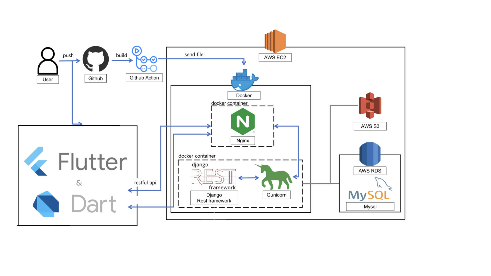

# 🍹 Ohzu

---


당신을 위한 맞춤형 칵테일 추천 서비스, 오쥬

<br/>


## 🥝 Services

1. 매일 랜덤으로 추천받는 다양한 칵테일!
2. 이름 또는 해시태그로 원하는 칵테일 검색! 
3. 해시태그로 제공하는 칵테일에 대한 자세한 정보!
4. 직접 만들어보고 싶은 칵테일 레시피 제공! 
5. 오직 당신만을 위한 맞춤형 추천 칵테일!

<br/>

## 📱 UI/UX


<b> (칵테일 일러스트 이미지의 저작권은 Ohzu 및 Ohzu의 디자이너에게 있습니다) </b>

<br/>

</br>

## 🛠 Tech Stack

### ✔️ Infra

|Docker|Github Actions|
|:---:|:---:|
||

### ✔️ DataBase

| MySQL                                                        | RDS                                                     |S3|
|--------------------------------------------------------------|---------------------------------------------------------|---|
|   |  |

### ✔️ Web Server

| EC2                                                      | ELB                                                      | Django                                                         | Nginx                                                        |gunicorn|
|----------------------------------------------------------|----------------------------------------------------------|----------------------------------------------------------------|--------------------------------------------------------------|---|
|   |  |  |  |


<br/>


## 🏛 Architecture




<br/>


## 📁 Project Structure

```
├─ .github
├─ config
│  └─ docker
│  └─ nginx
│  └─ scripts
│ 
├─ images
├─ landingpage (앱)
│     ├─ migrations
│     ├─ __init__.py
│     ├─ admin.py
│     ├─ apps.py
│     └─ models.py
│     └─ serializers.py
│     └─ tests.py
│     └─ urls.py
│     └─ views.py
│ 
├─ main (앱)
│     ├─ migrations
│     ├─ __init__.py
│     ├─ admin.py
│     ├─ apps.py
│     └─ models.py
│     └─ serializers.py
│     └─ tests.py
│     └─ urls.py
│     └─ views.py
│ 
├─ Ohzu-BackEnd (프로젝트)
│     ├─ settings
│     ├─ __init__.py
│     ├─ asgi.py
│     ├─ urls.py
│     └─ wsgi.py
│ 
├─ docker-compose.prod.yml
├─ docker-compose.yml
├─ Dockerfile
├─ Dockerfile.prod
├─ manage.py
├─ README.md
├─ requirements.txt

```

<br/>
  
## 😎 Backend Developer

<table>
    <tr align="center">
        <td><B>Backend<B></td>
        <td><B>Backend<B></td>
    </tr>
    <tr align="center">
        <td><B>이수진<B></td>
        <td><B>서수경<B></td>
    </tr>
    <tr align="center">
        <td>
            
            <br>
            <a href="https://github.com/ssssujini99"><I>ssssujini99</I></a>
        </td>
        <td>
            
            <br>
            <a href="https://github.com/sukyeongs"><I>sukyeongs</I></a>
        </td>
    </tr>
    <tr align="center">
        <td align="center">
            <B>✔️ 프로젝트 세팅 (django)</br>
            <B>✔️ 서버 배포 및 도메인, 기타 세팅 (docker, github action, ec2, rds, aws s3)</br>
            <B>✔️ 칵테일 DB setup</br>
            <B>✔️ 프로젝트 ERD modeling</br>
            <B>✔️ 검색(이름, 태그검색) API 구현</br>
            <B>✔️ 칵테일 세부조회 API 구현</br>
            <B>✔️ 렌딩페이지 ERD modeling</br>
            <B>✔️ 렌딩페이지 서버 세팅 및 배포</br>
            <B>✔️ 렌딩페이지 질문페이지 API 구현</br>
        </td>
        <td align="center">
            <B>✔️ </br>
            <B>✔️ </br>
            <B>✔️ </br>
            <B>✔️ </br>
            <B>✔️ </br>
            <B>✔️ </br>
            <B>✔️ </br>
            <B>✔️ </br>
            <B>✔️ </br>
        </td>
    </tr>
</table>
